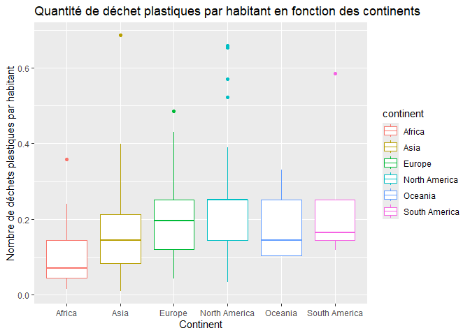
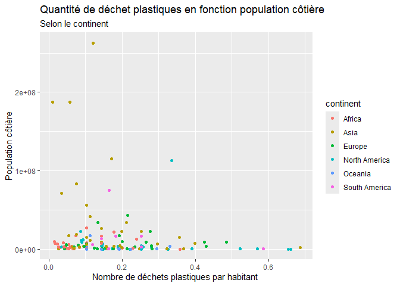

Lab 02 - Plastic waste
================
LE SCOUARNEC Maïa
21/09/2025

## Chargement des packages et des données

``` r
library(tidyverse) 
```

``` r
plastic_waste <- read_csv("data/plastic-waste.csv")
```

Commençons par filtrer les données pour retirer le point représenté par
Trinité et Tobago (TTO) qui est un outlier.

``` r
plastic_waste <- plastic_waste %>%
  filter(plastic_waste_per_cap < 3.5)
  ggplot(data = plastic_waste, 
         aes(x = plastic_waste_per_cap)) +
  geom_histogram(binwidth = 0.2)+
    labs(x= "quantité de plastique non gérés", y = "continent" )
```

<!-- -->

## Exercices

### Exercise 1

``` r
# insert code here
ggplot(data = plastic_waste,
       aes(x= plastic_waste_per_cap))+
  geom_histogram(binwidth = 0.2)+
  labs(x= "quantité de plastique non gérés", y = "continent" )+
  facet_wrap(~continent)
```

<!-- --> On
remarque que le continent Américian ( Nord et Sud) et le continent
asiatique ont des pays qui produisent plus de 0.5 tonne de plastique
contrairement aux autres continents qui voit leur production inférieure
à 0.5. ON voit aussi que la majorité des pays de chaque continent ont
quand même une production de plastique inférieur à 0.25 tonnes.

### Exercise 2

``` r
# insert code here
ggplot(data = plastic_waste,
       aes(x= plastic_waste_per_cap, color = continent, fill = continent))+
  geom_density(size= 0.15,alpha= 0.5)
```

    ## Warning: Using `size` aesthetic for lines was deprecated in ggplot2 3.4.0.
    ## ℹ Please use `linewidth` instead.
    ## This warning is displayed once every 8 hours.
    ## Call `lifecycle::last_lifecycle_warnings()` to see where this warning was
    ## generated.

<!-- -->

Color, fill se trouvent dans aes car ils sont conditionnés pour chaque
variable, alors que alpha se trouve dans geom_density car on souhaite
que toutes les variables soient à la même transparence.

### Exercise 3

Boxplot:

``` r
# insert code here
ggplot(data = plastic_waste,
       aes(x= continent, y= plastic_waste_per_cap, color = continent))+
  geom_boxplot()
```

<!-- -->

Violin plot:

``` r
# insert code here
ggplot(data = plastic_waste,
       aes(x= continent, y= plastic_waste_per_cap, color = continent))+
  geom_violin()
```

<!-- -->

Le graphe violin permet de mieux voir la répartiton dans les continents,
il possède une meilleure précision de l’uniformité ou non de la
production de plastique en tonne. Par exemple sur le graph box on ne
voit pas de médiane dans la moyenne de l’Amérique du Nord, or grace au
violin on voit bien que l’on à une majorité entre 0.25 et 0.3 tonnes de
porduction de plastique.

De plus on comprend mieux les points qui apparaissaient sur le graph
box.

### Exercise 4

``` r
# insert code here
ggplot (data= plastic_waste, 
        aes (x= plastic_waste_per_cap, y=mismanaged_plastic_waste_per_cap, color= continent))+
  geom_point()
```

<!-- -->

Le nuage de point montre qu’il existe une relation entre la production
de déchet et la quantité qui est mal gérée. On remarque que plus le
continent produit de déchet par habitant, moins il est en capacité de
les gérer correctement. Pourtant on remarque quelques points qui ne
suivent pas la tendance. Cela montre que certains pays malgrés une
production faible de déchet ne sont pas en capacité de les gérer. (Ex le
point marron représentant un pays d’Asie)

### Exercise 5

``` r
# insert code here
ggplot (data= plastic_waste, 
        aes (x= plastic_waste_per_cap, y=total_pop, color= continent))+
  geom_point()
```

    ## Warning: Removed 10 rows containing missing values or values outside the scale range
    ## (`geom_point()`).

<!-- -->

``` r
# insert code here
ggplot (data= plastic_waste, 
        aes (x= plastic_waste_per_cap, y=coastal_pop, color= continent))+
  geom_point()
```

<!-- -->

On remarque qu’il est compliqué de lire le graph 1 car la population est
tres grand et cela rend compliqué l’observation entre le nombre total
d’habitant et la porduction de déchet par habitant. Par contre pour le
graph 2, on remarque que les contients avec une plus grande population
cotière ont une production de déchets plus élevée par habitant. Par
exemple l’Océanie qui est très cotière, à une plus grande production de
déchet par habitant, que l’Asie qui a beaucoup moins de territoires
cotiers.

## Conclusion

Recréez la visualisation:

``` r
# insert code here
```
